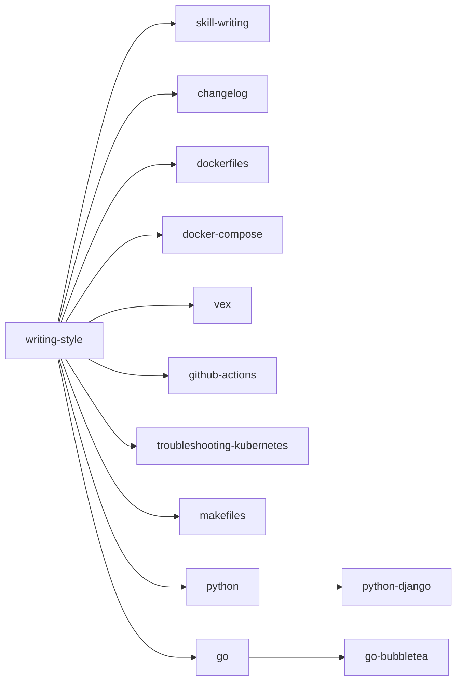

# `skills`
Documentation AI agents can use to approach software-related problems like how I would. 

## Skills

| Skill | Purpose |
| --- | --- |
| [changelog](skills/changelog/SKILL.md) | Repository release notes |
| [docker-compose](skills/docker-compose/SKILL.md) | Compose services, connectivity, and startup |
| [dockerfiles](skills/dockerfiles/SKILL.md) | Container image builds and runtime packaging |
| [github-actions](skills/github-actions/SKILL.md) | Workflows, reusable actions, and failed jobs |
| [go](skills/go/SKILL.md) | Go source, tests, and examples |
| [go-bubbletea](skills/go-bubbletea/SKILL.md) | Go terminal interfaces with Bubble Tea |
| [makefiles](skills/makefiles/SKILL.md) | Project tasks, builds, and checks |
| [python](skills/python/SKILL.md) | Python source, tests, and examples |
| [python-django](skills/python-django/SKILL.md) | Django applications and framework behavior |
| [skill-writing](skills/skill-writing/SKILL.md) | Reusable agent skill authoring and review |
| [troubleshooting-kubernetes](skills/troubleshooting-kubernetes/SKILL.md) | Kubernetes workload and service failures |
| [vex](skills/vex/SKILL.md) | Vulnerability Exploitability eXchange assessments |
| [writing-style](skills/writing-style/SKILL.md) | Plain, practical prose and documentation |

## Skill map

Arrows point from a skill to the skills it influences.

